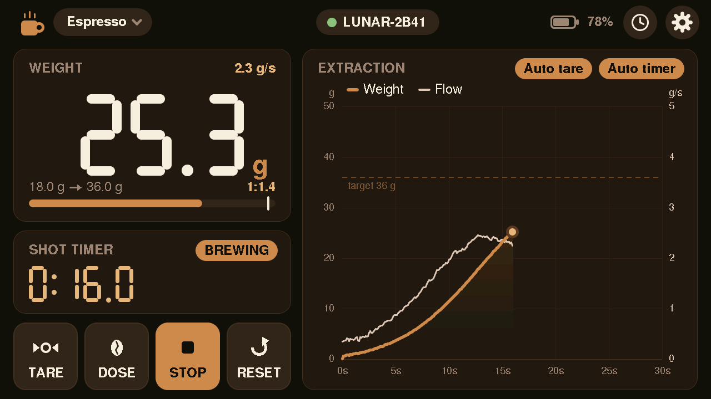
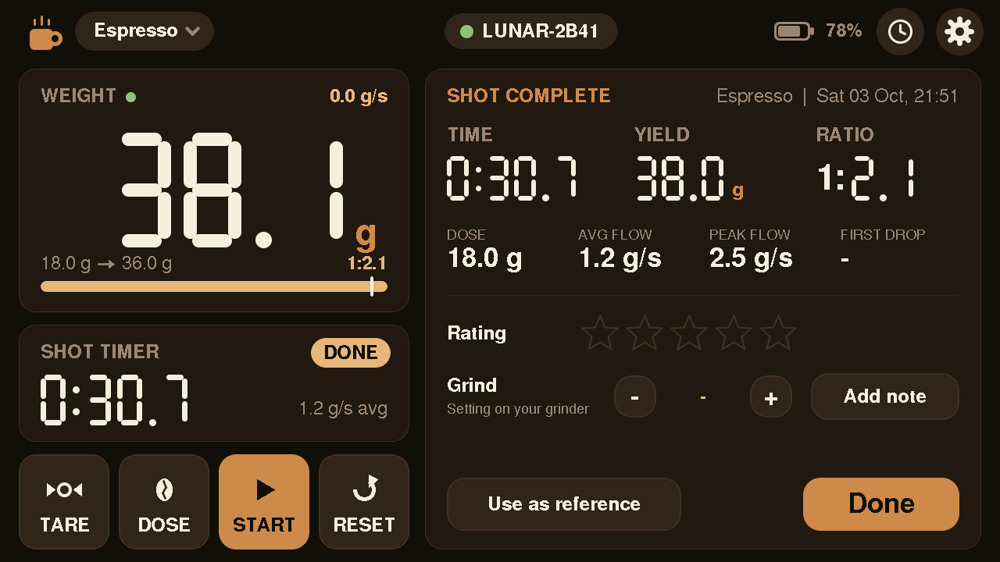
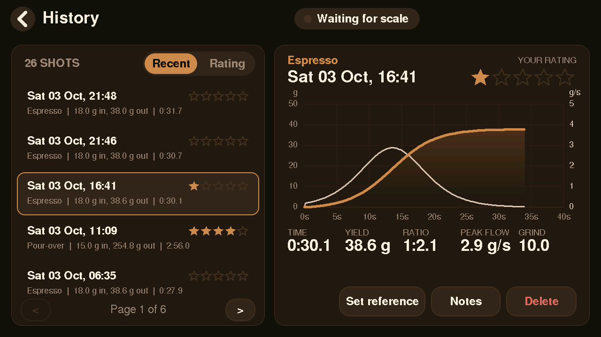
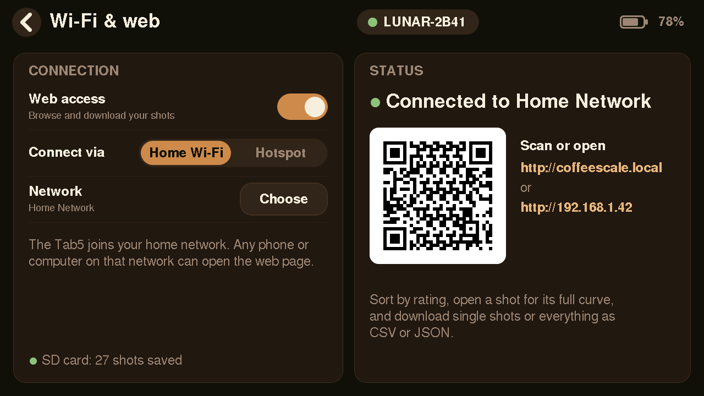

# Coffee Scale Display — M5Stack Tab5 + Acaia Lunar

Turns an **M5Stack Tab5** (ESP32‑P4, 5" 1280×720 touch) into a large display and shot
journal for an **Acaia Lunar** (also works with Pearl S, Pyxis and other Acaia scales).




## Features

**Brewing**
- **Live weight** in large segment digits, with flow rate (g/s)
- **Extraction plot**: weight and flow over time. It starts on its own as soon as the
  weight changes. The last shot stays visible, dimmed.
- **Shot timer**: start/stop by hand, or automatically
  - *Auto start*: starts with the plot when the weight starts rising
  - *Auto stop*: stops once the weight hasn't risen for the recipe's delay
- **Auto tare** when a cup is placed or removed (a fast jump is a cup, not coffee),
  plus manual **Tare**, **Start/Stop** and **Reset**
- **Recipes**: Espresso, Ristretto, Lungo, Pour‑over and Free. Each keeps its own dose, ratio,
  auto‑stop delay and start threshold. Pick one from the chip in the top bar. Each recipe can be
  **renamed** and switched between espresso style and pour-over (timed pours), so unused slots
  can be reused, e.g. Lungo → "Single shot". **Reset** restores a slot's original settings.
  Past shots keep the name they were made with.
  Every recipe value can be stepped with − / + or **typed on a number pad** (tap the value);
  the shot-time window has *From* / *To* fields and is checked before it's saved.
- **Dose and ratio**: tap **DOSE**, put the beans on the scale, tap **SAVE**. The dose is
  stored in the recipe, the target becomes *dose × ratio*, and the live ratio (`1:2.1`) is
  shown while you brew.
- **Drip compensation**: the target beep comes early by the weight that still ends up in
  the cup after you stop. That amount is learned from your last shots (the white tick
  on the progress bar).
- **Flow guide**: each recipe has a target flow band, shown as a strip on the plot. On **Auto**
  it is calculated from the target yield and the shot-time window (0.8 × yield ÷ longest time
  to 2 × yield ÷ shortest time; espresso 36 g in 25–32 s → 0.9–2.9 g/s) and follows any change
  to dose, ratio or time. **Set** lets you type your own band, **Off** disables it (default for
  pour-over). When the flow stays above or below it, the timer card shows
  **FLOW HIGH / FLOW LOW**, the flow readout turns amber and it beeps once (the first drops and
  the natural slowdown at the end don't count). The summary shows how much of the shot was in
  the band, and the dial-in assistant flags uneven flow.
- **Pour‑over stages**: bloom and timed pours with on‑screen cues ("Pour to 149 g",
  "next pour in 0:12"), a beep when the next pour is due, and stage lines on the plot
- **Ghost curve**: the last shot or your reference shot of the same recipe, drawn behind
  the live plot
- **Shot summary** after every shot: time, yield, ratio, dose, average and peak flow, first
  drop (when you start the timer yourself), **star rating**, **grind setting**, **notes**
  (on‑screen keyboard) and *Use as reference*
- **Dial-in assistant** in the shot summary: compares the shot time with your reference shot
  (same recipe) or the recipe's time window and suggests the next grind setting, e.g.
  *"Ran 5 s slow: try 11.5 (now 10.0), about -9 s"*. It learns your grinder from the history
  (seconds per grind unit for that recipe and dose). Tap **Sour / Balanced / Bitter** to refine:
  sour on time → longer ratio, bitter → shorter; fast and bitter → check puck prep.
  **Use grind …** carries the setting into the next shot (shown on the timer card).

**History** (needs a microSD card in the Tab5)
- Every shot is saved with its full curve. Without a card nothing is stored, and the
  display tells you so.
- History screen: sort by most recent or rating, full curve with the reference overlaid,
  rate, add notes, set the reference, delete



**Web UI** (Settings → Wi‑Fi & web)
- Connect via your **home Wi‑Fi** (choose a network, type the password on screen) or let
  the Tab5 open its own **hotspot**. A QR code on the screen gets your phone there.
- Open `http://coffeescale.local` (or the IP shown). You get:
  - an overlay of every shot of one recipe, with the reference highlighted
  - a shot grid with sparklines, filters by recipe, and sorting by **rating** or
    **most recent**
  - a detail view with an interactive chart (hover for time, weight and flow), rating,
    reference and delete
  - downloads: a single shot as **JSON** or **CSV**, or everything as one JSON file or a
    summary CSV
- It follows the display's colour scheme and works offline (no external assets)



**Backup**
- Settings and recipes are backed up **automatically to the SD card** a few seconds after a
  change (`/coffeescale/settings-backup.json`; never during a shot). The Wi‑Fi password is
  not included.
- Settings → **System**: backup status, *Back up now*, *Restore* (with confirmation), device info
  and *Run first-time setup*. A fresh Tab5 with a backup on its card offers the restore right on
  the welcome screen.
- Web page → Download menu: *Download settings backup* and *Restore from a backup file*.
  After a restore the display restarts.

**Firmware update over Wi‑Fi**
- On the Tab5: Settings → **System** → *Allow web update (10 min)*. Uploads are refused unless
  someone at the display allowed them.
- Web page → Download menu → *Update firmware*: pick `firmware-archive/coffeescale-tab5.bin` (a copy of
  `.pio/build/m5stack-tab5/firmware.bin` that each build writes). Other files, such as the C6 image,
  are refused before anything is written. The screen may flicker blue while the update is
  written to flash.
  The Tab5 shows a progress screen and restarts into the new firmware.
- Automatic rollback: the new firmware has to run for 30 s before it is marked good. If it
  crashes or restarts earlier, the Tab5 boots the previous version again, and System shows
  *(update undone)*.
- Not possible during a shot. The C6 co‑processor firmware is updated separately (see below).

**Device**
- First‑run setup wizard, auto reconnect when the scale is switched on
- Battery levels: the scale's inside the connection pill, the Tab5's own (with a charging bolt)
  at the top right. The Tab5 battery is hidden when it runs without a battery pack.
- Two colour schemes: **Roast** (espresso brown + caramel) and **Racer** (black + racing red,
  inspired by the Sanremo Cafe Racer Naked)
- Screen sleep when idle; wakes on touch or weight change
- Time from the Tab5's RTC, synced over the internet when on home Wi‑Fi (timezone:
  `DEVICE_TZ` in `src/Settings.h`)

## Build & flash

Requires [PlatformIO](https://platformio.org/). The project uses the
[pioarduino](https://github.com/pioarduino/platform-espressif32) platform (Arduino‑ESP32 3.3.x),
which supports BLE and Wi‑Fi on the ESP32‑P4 through the Tab5's ESP32‑C6 co‑processor.

```bash
pio run -e m5stack-tab5 -t upload
pio device monitor
```

On first boot the setup wizard opens. Switch on the Lunar, and make sure it isn't connected
to the Acaia phone app, since a scale only accepts one connection. Then pick it from the list.

The web page lives in `web/index.html` and is gzipped into the firmware at build time
(`tools/embed_web.py`).

### SD card

Use a FAT32‑formatted microSD card. Shots go to `/coffeescale/` (`index.json` plus one
`shots/<id>.json` per shot). The card is detected when inserted; no restart needed.

### Troubleshooting

- **Wi‑Fi connected, but the web page doesn't load** (the Tab5 doesn't answer ping either):
  Wi‑Fi power save is turned off for this reason. In modem sleep the C6 picked up traffic
  addressed to the Tab5 only now and then, while multicast (mDNS) kept working. After
  connecting, the log shows `[WiFi] connected to ... power save off`. If it says
  `can't turn power save off`, the C6 refused it. Also, while connected, the Tab5 pings its router every 15 s. Once the router has answered, three
  missed checks in a row reconnect Wi‑Fi. Serial log: `[WiFi] router not answering ...` and
  `... no traffic gets through, reconnecting`. Routers that never answer ping turn the check off.

- **Connected, but the weight doesn't change**: the display marks this with *NO DATA FROM
  SCALE* and an amber dot. It asks the scale for weight again after 1.5–3 s and reconnects
  after 10 s without readings. The serial monitor logs `[BLE] no weight for ...`.

- **No scales found**: the serial monitor prints the ESP‑Hosted host and C6 co‑processor
  firmware versions at boot. If BLE isn't active or the log says the C6 firmware is out of
  date, update the C6 with the bundled updater (it downloads the matching ESP‑Hosted
  firmware over Wi‑Fi and asks for the Wi‑Fi credentials in the serial monitor):
  ```bash
  pio run -e c6-update -t upload && pio device monitor -e c6-update
  ```
  Then flash the main firmware again (`pio run -e m5stack-tab5 -t upload`).
  The C6 must run exactly the ESP‑Hosted version of the Arduino core (2.11.6 here). The
  updater also replaces a *newer* C6 firmware (e.g. 3.x from another tool): Wi‑Fi may work
  with a mismatch, but Bluetooth doesn't start (`esp_hosted_bt_controller_init failed`).
- **SD card not detected**: the card is used in SPI mode (`[SD] card mounted` in the log).
  SD_MMC mode is deliberately not used: the P4's SD host controller also carries the link to
  the C6 radio chip, and (un)mounting a card through it breaks Wi‑Fi and Bluetooth.
- **Crash reports**: after an unexpected restart the log shows `[DIAG]` lines with the
  firmware id. Every build is kept in `firmware-archive/<id>.elf`, so addresses can be
  decoded with `riscv32-esp-elf-addr2line -pfiaC -e firmware-archive/<id>*.elf <addr>`.
- **`coffeescale.local` doesn't open**: some Android phones don't resolve `.local` names;
  use the IP address shown on the Wi‑Fi screen.
- **Board variant**: `m5stack-tab5-p4` targets the ESP32‑P4 revisions shipped in the Tab5
  (pre rev 3.0). If a later Tab5 has a rev 3.x P4 and won't boot, change the board accordingly.
- **UI speed**: the serial log prints frame times every 5 s (`[UI] ... avg draw / push`), and at boot
  `[UI] display: PPA hardware rotation (self-test passed)` (or why it fell back to software).

## Desktop simulator

The UI runs on macOS/Linux with SDL2 and a simulated scale that plays a scripted
espresso shot: cup placed → auto tare → about 30 s extraction → auto stop → summary.
A folder (`sim/sdcard/`) stands in for the SD card.

```bash
brew install sdl2
HOMEBREW_PREFIX=/opt/homebrew pio run -e native && .pio/build/native/program
```

| Variable | Effect |
|----------|--------|
| `SIM_SCREEN=…` | open `welcome`, `scan`, `prefs`, `settings`, `recipes`, `history`, `wifi` or `networks` |
| `SIM_SEED=24` | write 24 made‑up shots to the simulated SD card |
| `SIM_NO_SD=1` | behave as if no card is inserted |
| `SIM_THEME=1` | Racer colour scheme |
| `SIM_WIFI=1` | pretend to be connected to a home network |
| `SIM_TAP=x,y@sec;…` | tap at logical coordinates after *sec* seconds |
| `SIM_SNAPS=5,20,46` | save PNGs to `sim/out/` at those seconds, then exit |
| `SIM_SETUP=1` | start unconfigured (setup wizard) |

### Web UI preview

```bash
SIM_SEED=24 SIM_SNAPS=1 .pio/build/native/program   # create some shots
python3 tools/webui_preview.py                        # http://localhost:8080
python3 tools/webui_preview.py --scheme racer
```

The preview server answers the same API as the Tab5, using the simulated SD card.

## Code layout

| File | Purpose |
|------|---------|
| `src/AcaiaScale.*` | BLE driver: scan, connect, Acaia protocol, heartbeat, auto reconnect (own task) |
| `src/Brew.*` | Shot logic: stability, flow, auto tare, auto start/stop, dosing, drip learning, plot samples |
| `src/Recipes.*` | Recipes with dose, ratio, time window, stop delay, threshold and pour‑over stages |
| `src/DialIn.*` | Dial-in assistant: advice rules and the learned grind/time model |
| `src/Ota.*` | Firmware update over Wi‑Fi: allow window, writing the image, rollback confirmation |
| `src/Battery.*` | Tab5 battery level and charging state |
| `src/Backup.*` | Settings + recipes backup (JSON) to the SD card and via the web API |
| `src/History.*` | Shot history on the SD card, ratings/notes, reference and ghost curves |
| `src/Storage.*` | SD card access (SPI mode), insert/remove detection |
| `src/Net.*` | Wi‑Fi (home or hotspot), mDNS, NTP and the web API (own task) |
| `src/UI.cpp` | Frame loop: partial redraws, rotation, touch, screen sleep |
| `src/Blit.*` | ESP32‑P4 PPA: rotates the landscape UI into the portrait panel and fills large areas by DMA (self‑tested at boot, software fallback) |
| `src/UIKit.*` | Widgets, icons, segment digits, plot |
| `src/UIMain.cpp` | Main screen and shot summary |
| `src/UIHistory.cpp`, `src/UIScreens.cpp`, `src/UINet.cpp` | History, settings/setup/recipes, Wi‑Fi and keyboard |
| `src/Theme.*` | Colour schemes (Roast, Racer) |
| `web/index.html` | The web UI (single file, embedded into the firmware) |
| `sim/`, `tools/` | Desktop simulator, web preview server, C6 updater, web embedding script |

### Web API

| Method | Path | |
|--------|------|-|
| GET | `/api/info` | device name, colour scheme, SD status, shot count, reference id |
| GET | `/api/shots` | all shots (metadata and sparkline) |
| GET | `/api/shot?id=N` | one shot including its curve (`&download=1` to save as a file) |
| GET | `/api/shot.csv?id=N` | one shot's curve as CSV |
| GET | `/api/export.json`, `/api/export.csv` | everything / summary of all shots |
| POST | `/api/rate?id=N&stars=K`, `/api/reference?id=N`, `/api/delete?id=N` | change a shot |
| GET / POST | `/api/backup` | download a settings backup / restore one (restarts the display) |
| POST | `/api/update` | firmware upload (multipart field `firmware`); 403 unless allowed on the Tab5 |

### Acaia protocol notes

Messages are `EF DD <type> <payload> <cksum_even> <cksum_odd>`. After connecting, the
display sends *ident* (type 0x0B) and a notification request (type 0x0C, which asks for
weight, battery, timer and key events), then a heartbeat (type 0x00) every 2.75 s. Weight
arrives as event 5: a 24‑bit value, a decimal exponent and a sign bit. Newer scales use
service `49535343‑fe7d‑…`; older ones use `0x1820` / characteristic `0x2A80`. Both are supported.
