# Coffee Scale Display for M5Stack Tab5 + Acaia

Turns an **M5Stack Tab5** (ESP32‑P4, 5" 1280×720 touch screen) into a big, fast espresso
display and shot journal for an **Acaia Lunar**. Pearl S, Pyxis and other Acaia scales work too.
It connects to the scale over Bluetooth and shows the live weight, flow and an extraction plot.
It times every shot, saves it to a microSD card and helps you dial in your grinder. A built-in
web page lets you browse and download every shot from your phone or computer.

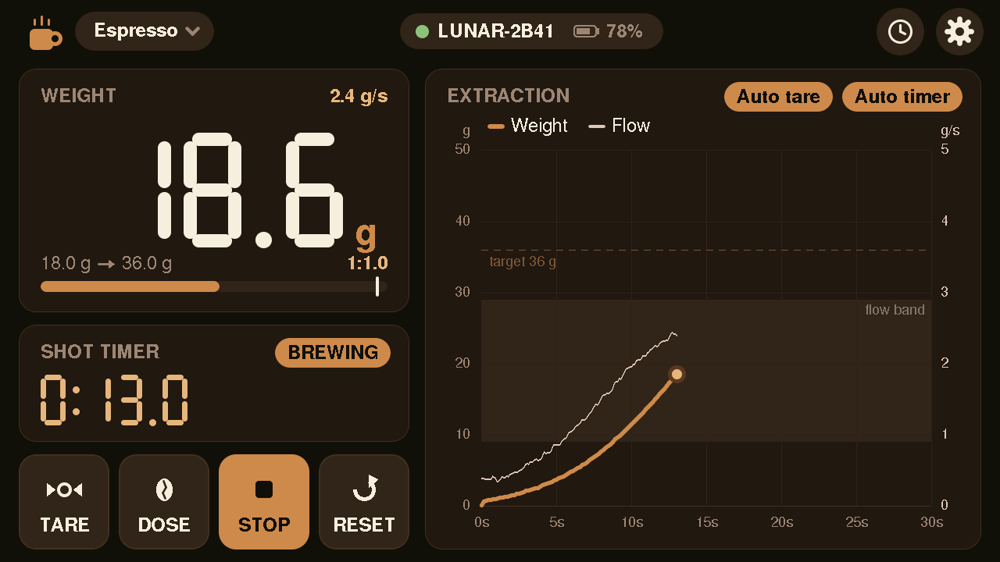

| Shot summary with dial-in assistant | Racer colour scheme |
|---|---|
| 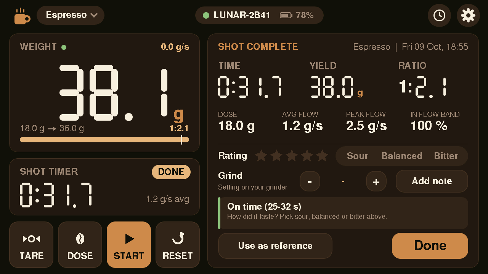 | 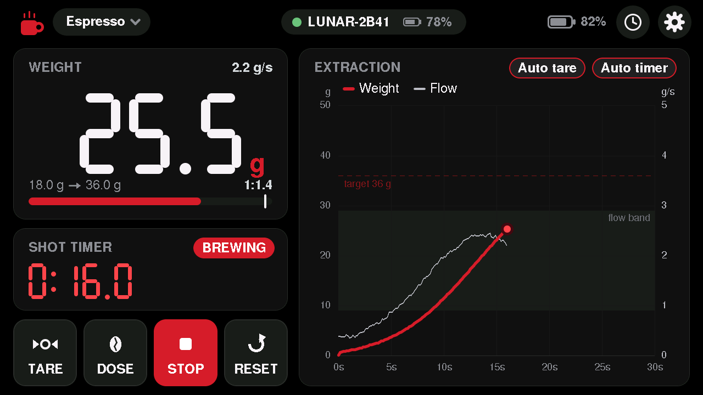 |

## Contents

- [Features](#features)
- [Hardware](#hardware)
- [Installation](#installation)
- [How it works](#how-it-works)
- [Using it](#using-it)
- [Web UI](#web-ui)
- [Troubleshooting](#troubleshooting)
- [Development](#development)
- [Acknowledgements and disclaimer](#acknowledgements-and-disclaimer)

## Features

**Brewing**
- **Live weight** in large segment digits, with the flow rate in g/s
- **Extraction plot** of weight and flow over time. It starts by itself as soon as the weight
  changes, and the last shot (or your reference shot) is drawn behind it as a *ghost curve*.
- **Shot timer** that starts when the weight starts rising and stops when it stops rising.
  You can also start, stop and reset it by hand.
- **Auto tare** when a cup is placed or removed, plus manual **Tare**
- **Recipes** (Espresso, Ristretto, Lungo, Pour‑over, Free), each with its own dose, ratio, shot-time
  window, flow band, auto‑stop delay and start threshold. Values can be stepped with − / + or
  typed on a number pad. Recipes can be renamed and switched between espresso and pour‑over style.
- **Dose and ratio**: weigh the beans with **DOSE**. The target yield becomes *dose × ratio*,
  and the live ratio is shown while brewing.
- **Drip compensation**: the target beep comes early by the amount that still drips into the
  cup after you stop. That amount is learned from your last shots.
- **Flow guide**: a target flow band on the plot, calculated from the target yield and shot time.
  The display warns with *FLOW HIGH / FLOW LOW* when the shot runs too fast or too slow.
- **Pour‑over stages**: bloom and timed pours, with cues like "Pour to 149 g" and a beep when the next pour is due
- **Shot summary** after every shot: time, yield, ratio, average and peak flow, time in the flow band,
  a star rating, taste (sour / balanced / bitter), grind setting and notes
- **Dial-in assistant**: compares the shot with your reference shot or the recipe's time window
  and suggests the next grind setting, e.g. *"Ran 5 s slow: try 11.5 (now 10.0)"*. It learns how
  your grinder responds from your shot history.

**History, web and device**
- **Shot history** on a microSD card, with the full curve of every shot. You can sort by most
  recent or by rating, set a reference shot, add notes and delete shots.
- **Web UI** over your home Wi‑Fi or the Tab5's own hotspot. A QR code on the display opens it on
  your phone. It shows all shots overlaid, filters, sorting by rating or recency, an interactive
  chart per shot, and downloads as JSON or CSV.
- **Backup** of settings and recipes to the SD card, plus download and restore via the web UI
- **Firmware updates over Wi‑Fi** from the web UI, with automatic rollback if the new firmware fails
- **Auto reconnect** when the scale is switched on, with battery levels for the scale and the Tab5
- **Two colour schemes**: *Roast* (espresso brown and caramel) and *Racer* (black and racing red)
- Screen sleep when idle; it wakes on touch or when the weight changes

<table>
<tr>
<td>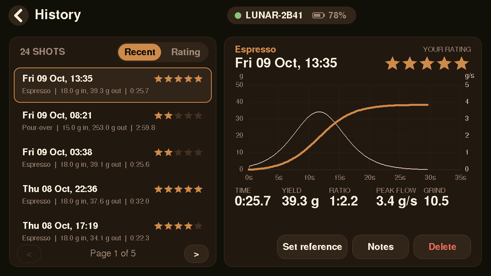</td>
<td>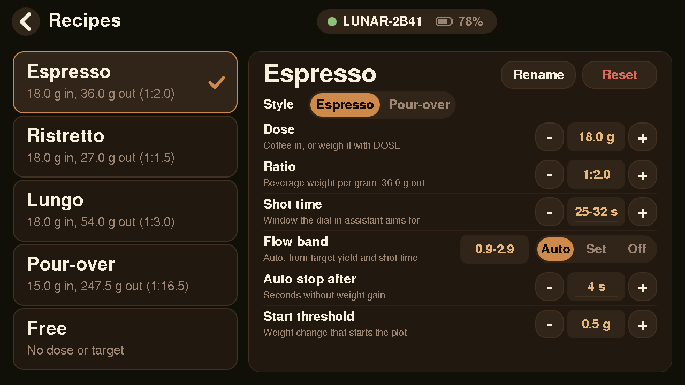</td>
</tr>
<tr>
<td align="center">Shot history</td>
<td align="center">Recipes</td>
</tr>
<tr>
<td>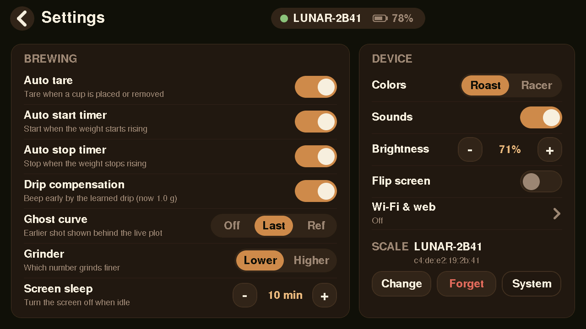</td>
<td>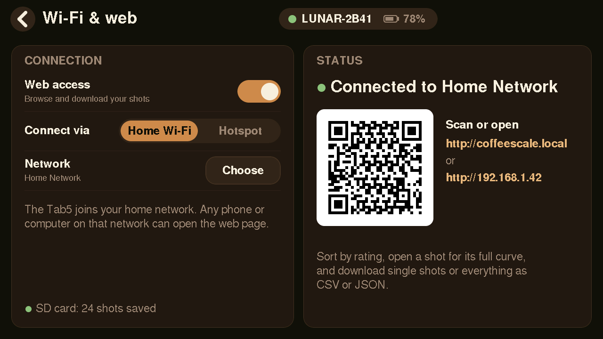</td>
</tr>
<tr>
<td align="center">Settings</td>
<td align="center">Wi‑Fi & web, with a QR code for your phone</td>
</tr>
</table>

## Hardware

| | |
|---|---|
| **Display** | [M5Stack Tab5](https://docs.m5stack.com/en/core/Tab5) (ESP32‑P4 with an ESP32‑C6 radio chip). The optional battery pack is supported. |
| **Scale** | Acaia Lunar (2021 and older models), Pearl / Pearl S, Pyxis, or another Acaia scale with Bluetooth |
| **microSD card** | Optional, FAT32. It is needed for the shot history and SD backups; everything else works without it. |
| **USB‑C cable** | For the first installation. Later updates can go over Wi‑Fi. |

## Installation

### 1. Install PlatformIO

Install [Visual Studio Code](https://code.visualstudio.com/) with the
[PlatformIO extension](https://platformio.org/install/ide?install=vscode), or the
[PlatformIO Core](https://docs.platformio.org/en/latest/core/installation/index.html) command line tool.
The project uses the [pioarduino](https://github.com/pioarduino/platform-espressif32) platform
(Arduino‑ESP32 3.3). PlatformIO downloads it, the toolchain and all libraries on the first build.

### 2. Get the code

```bash
git clone https://github.com/<your-user>/coffee-scale-tab5.git
cd coffee-scale-tab5
```

### 3. Flash the Tab5

Connect the Tab5 with a USB‑C cable, then:

```bash
pio run -e m5stack-tab5 -t upload
```

In VS Code, pick the `m5stack-tab5` environment in the PlatformIO toolbar and click **Upload**.
If the upload doesn't start, hold the Tab5's reset button for about 2 seconds to enter download
mode, then try again.

To watch the log (useful the first time):

```bash
pio device monitor
```

### 4. Check the radio chip (once)

Bluetooth and Wi‑Fi run on the Tab5's ESP32‑C6 chip. Its firmware (ESP‑Hosted) must match the
version in the Arduino core, which is **2.11.6** here. At boot the log prints both versions:

```
[BLE] ESP-Hosted host 2.11.6, C6 co-processor 2.11.6, BLE active
```

If the versions differ, or the display never finds a scale, update the C6 once with the
bundled updater:

```bash
pio run -e c6-update -t upload && pio device monitor -e c6-update
```

The updater downloads the matching firmware over Wi‑Fi and asks for your Wi‑Fi name and
password in the serial monitor; nothing is stored. If that doesn't work, put
`esp32c6-v2.11.6.bin` in the root of the microSD card instead. The updater prints the download
address of that file. Afterwards, flash the main firmware again
(step 3).

### 5. First-time setup

1. Switch on the scale. Make sure the Acaia app isn't connected to it, because a scale only
   accepts one connection.
2. The setup wizard on the Tab5 lists nearby Acaia scales. Pick yours, or choose *Use any Acaia*.
3. Choose your brewing preferences (auto tare, auto start and stop timer) and a colour scheme.
   Tap *Finish*.

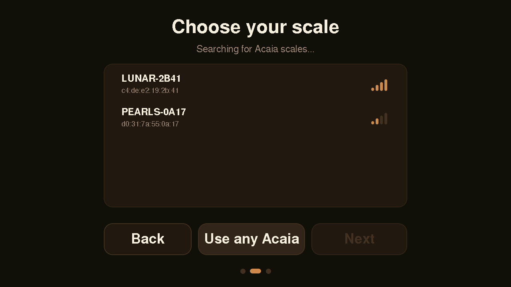

From now on the Tab5 reconnects by itself whenever the scale is switched on.

### Updating later

When the Tab5 is on Wi‑Fi, you can update it without a cable:

1. Build the firmware: `pio run -e m5stack-tab5`. Each build also copies it to
   `firmware-archive/coffeescale-tab5.bin`.
2. On the Tab5: **Settings → System → Allow web update (10 min)**. Uploads are refused without
   this step.
3. On the web page: **Download menu → Update firmware**, then pick `coffeescale-tab5.bin`.

The Tab5 shows a progress screen and restarts into the new version. The screen may flicker
blue while the update is written to flash; that's normal. If the new firmware crashes or
restarts within its first 30 seconds, the Tab5 goes back to the previous version by itself.

## How it works

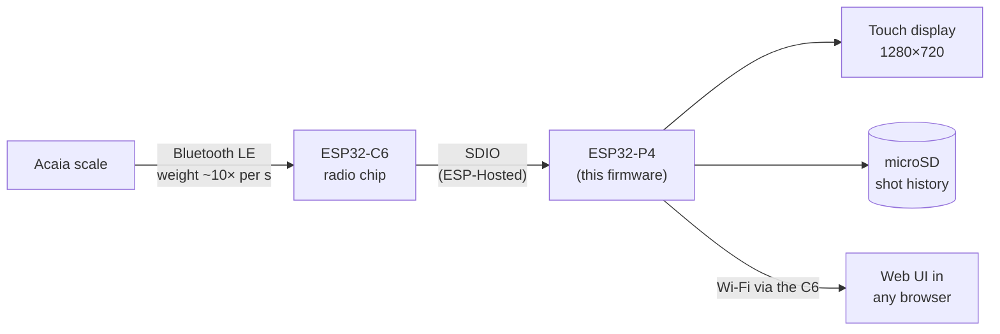

- **Scale connection**: the Tab5's main processor (ESP32‑P4) has no radio of its own. It talks to
  the scale through the ESP32‑C6 radio chip using Espressif's *ESP‑Hosted* firmware. The firmware
  identifies itself to the scale with the Acaia protocol, subscribes to weight, battery and timer
  events, and sends a heartbeat every few seconds. If weight readings stop, it re‑subscribes
  first, then reconnects.
- **Shot detection**: every weight reading goes through the shot logic (`src/Brew.cpp`):
  1. A sudden jump while the weight is stable is a cup being placed, which triggers auto tare.
  2. When the weight rises past the recipe's start threshold, the plot and timer start.
  3. Flow is the smoothed rate of weight change. It is checked against the recipe's flow band.
  4. When the weight hasn't risen for the recipe's auto-stop delay, the shot ends. The end time
     is set back to the last rise, so the waiting time doesn't count.
  5. The shot summary opens. The shot is saved to the SD card, and the dial-in assistant compares
     it with your reference shot.
- **Drawing**: the UI is drawn into a landscape frame buffer in PSRAM and rotated into the
  portrait‑mounted panel by the P4's pixel processing hardware (PPA). Only regions that changed are
  redrawn, which keeps touch response and the plot smooth.
- **Web UI**: a single HTML file (`web/index.html`) is compressed into the firmware at build time.
  The page loads shot data from a small JSON API on the Tab5.

## Using it

- **Pull a shot**: put the cup on the scale. It tares itself, and the timer and plot start with the
  first drops and stop on their own. Then rate the shot and enter your grind setting in the summary.
- **Dose**: tap **DOSE**, put the beans (in their cup) on the scale and tap **SAVE**. The target
  yield follows from the recipe's ratio.
- **Switch recipe**: tap the recipe chip at the top left. Edit recipes under
  **Settings → Recipes**, or tap a value to type it on the number pad.
- **Dial in**: mark a shot you like as the reference (in the summary or the History). Later
  shots of the same recipe are compared with it, and the assistant suggests a grind change.
- **History**: the clock icon at the top right opens it.
- **Wi‑Fi**: **Settings → Wi‑Fi & web** joins your home network, or lets the Tab5 open its own
  hotspot. Scan the QR code, or open `http://coffeescale.local` or the IP address shown.

## Web UI

| Every shot at a glance | Shot details |
|---|---|
| 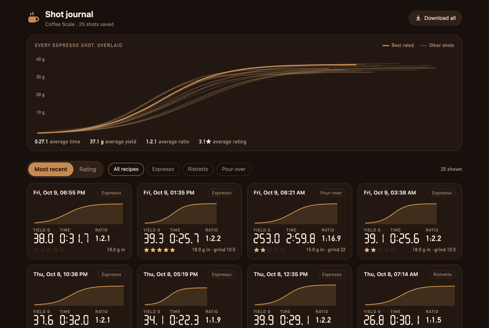 | 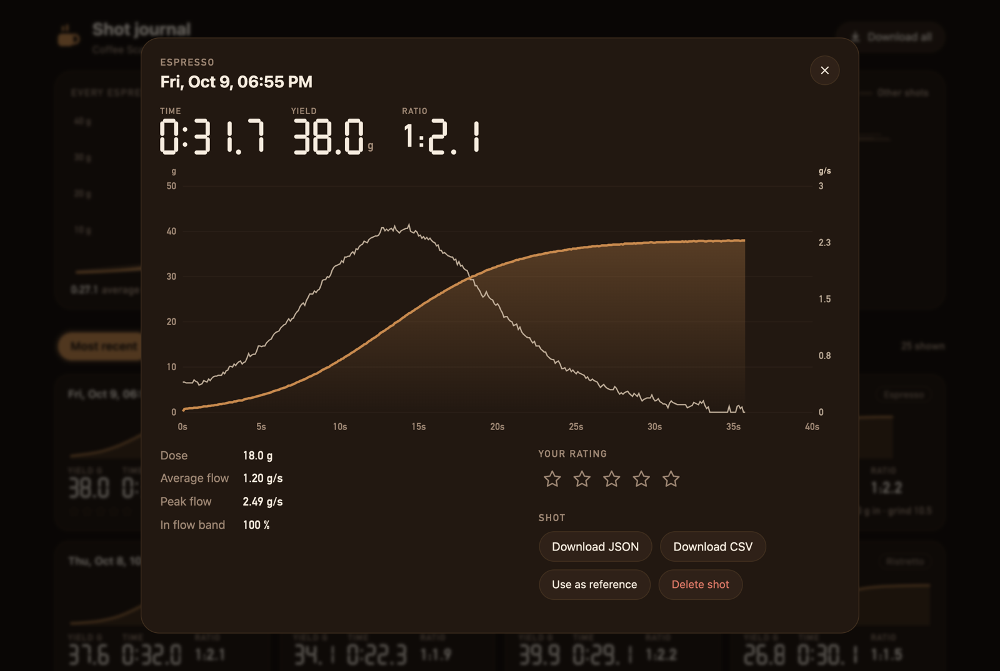 |

| Racer colour scheme | On a phone |
|---|---|
| 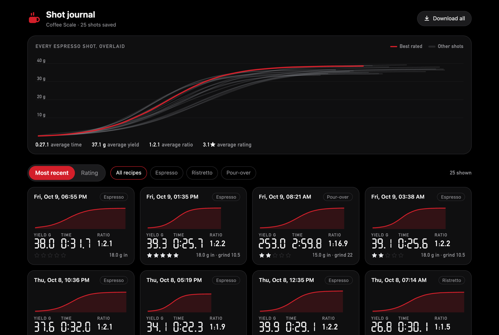 | 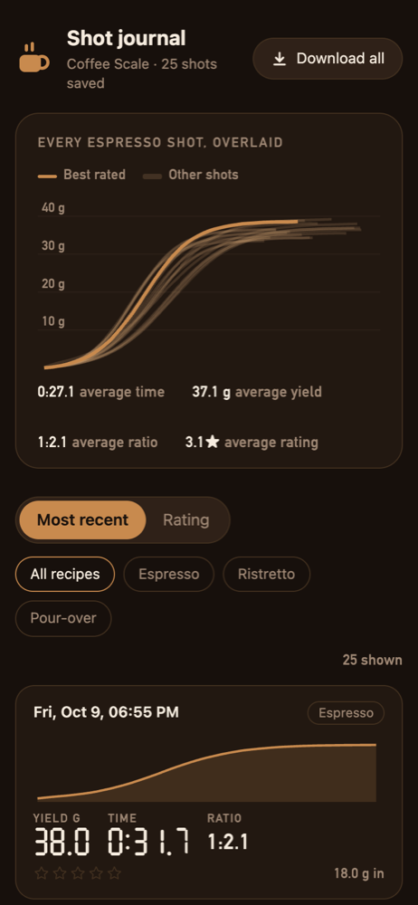 |

- All shots of a recipe overlaid, with the best‑rated one highlighted
- Shot cards with sparklines, filtering by recipe, sorting by **rating** or **most recent**
- Detail view with an interactive chart (hover for time, weight and flow), rating, reference and delete
- Downloads: a single shot as JSON or CSV, everything as one JSON file, or a summary CSV
- Settings backup and restore, and firmware updates
- It follows the display's colour scheme and works offline (no external assets)

## Troubleshooting

- **No scale found**: check that the Acaia app isn't connected to the scale. Then check the C6
  firmware version in the boot log (see [step 4](#4-check-the-radio-chip-once)). If the C6 runs
  any other version, including a newer one, Wi‑Fi may still work but Bluetooth won't start
  (`esp_hosted_bt_controller_init failed`).
- **Connected, but the weight doesn't change**: the display shows *NO DATA FROM SCALE* and an amber
  dot. It asks the scale for weight again after 1.5–3 s and reconnects after 10 s without readings.
  The log shows `[BLE] no weight for ...`.
- **Wi‑Fi connected, but the web page doesn't load**: the log should show
  `[WiFi] connected to ... power save off`. Wi‑Fi power save is switched off, because in power save
  the C6 picked up traffic for the Tab5 only now and then. The Tab5 also pings its router every
  15 s and reconnects Wi‑Fi when the router stops answering.
- **`coffeescale.local` doesn't open**: some Android phones don't resolve `.local` names. Use the
  IP address shown on the Wi‑Fi screen instead.
- **SD card not detected**: use a FAT32 card. It's read in SPI mode (`[SD] card mounted` in the
  log). SD_MMC mode isn't used on purpose: the P4's SD host also carries the link to the C6, and
  mounting a card through it breaks Wi‑Fi and Bluetooth.
- **Crash reports**: after an unexpected restart, the log shows `[DIAG]` lines with a firmware ID.
  Every build is kept in `firmware-archive/<id>.elf`, so crash addresses can be decoded with
  `riscv32-esp-elf-addr2line -pfiaC -e firmware-archive/<id>*.elf <addresses>`.
- **Timezone**: times are shown for `DEVICE_TZ` in `src/Settings.h` (default: Central European
  Time). Change it to your [POSIX TZ string](https://github.com/nayarsystems/posix_tz_db/blob/master/zones.csv)
  and rebuild. The web UI uses your browser's timezone.
- **Board variant**: `m5stack-tab5-p4` targets the ESP32‑P4 revision shipped in the Tab5 (before
  rev 3.0). If a later Tab5 with a rev 3.x chip won't boot, change the board in `platformio.ini`.

## Development

### Desktop simulator

The whole UI runs on macOS or Linux with SDL2 and a simulated scale. The simulated scale plays a
scripted espresso shot: cup placed → auto tare → about 30 s extraction → auto stop → summary.
The folder `sim/sdcard/` stands in for the SD card.

```bash
brew install sdl2            # Linux: apt install libsdl2-dev
HOMEBREW_PREFIX=$(brew --prefix) pio run -e native && .pio/build/native/program
```

| Variable | Effect |
|----------|--------|
| `SIM_SCREEN=…` | open `welcome`, `scan`, `prefs`, `settings`, `recipes`, `history`, `wifi`, `networks` or `system` |
| `SIM_SEED=24` | write 24 made‑up shots to the simulated SD card |
| `SIM_NO_SD=1` | behave as if no card is inserted |
| `SIM_THEME=1` | Racer colour scheme |
| `SIM_WIFI=1` | pretend to be connected to a home network |
| `SIM_SETUP=1` | start unconfigured (setup wizard) |
| `SIM_BATT=64,1` | Tab5 battery level and charging state |
| `SIM_STALL=12,16` | no weight readings between these seconds |
| `SIM_TAP=x,y@sec;…` | tap at logical coordinates after *sec* seconds |
| `SIM_SNAPS=5,20,46` | save PNG screenshots to `sim/out/` at those seconds, then exit |

### Web UI preview

```bash
SIM_SEED=24 SIM_SNAPS=1 .pio/build/native/program   # create some shots
python3 tools/webui_preview.py                        # http://localhost:8080
python3 tools/webui_preview.py --scheme racer
```

The preview server answers the same API as the Tab5, using the simulated SD card.

### Code layout

| File | Purpose |
|------|---------|
| `src/AcaiaScale.*` | BLE driver: scan, connect, Acaia protocol, heartbeat, weight watchdog, auto reconnect (own task) |
| `src/Brew.*` | Shot logic: stability, flow, auto tare, auto start/stop, dosing, drip learning, flow guide |
| `src/Recipes.*` | Recipes: dose, ratio, time window, flow band, stop delay, threshold, pour‑over stages |
| `src/DialIn.*` | Dial-in assistant: advice rules and the learned grind/time model |
| `src/History.*` | Shot history on the SD card, ratings/notes, reference and ghost curves |
| `src/Storage.*` | SD card access (SPI mode), insert/remove detection |
| `src/Net.*` | Wi‑Fi (home or hotspot), mDNS, NTP, link watchdog and the web API (own task) |
| `src/Ota.*` | Firmware update over Wi‑Fi: allow window, image checks, rollback confirmation |
| `src/Backup.*` | Settings and recipes backup (JSON) to the SD card and via the web API |
| `src/Battery.*` | Tab5 battery level and charging state |
| `src/Diag.*` | Reset reasons and crash summaries |
| `src/UI.cpp` | Frame loop: partial redraws, touch, screen sleep |
| `src/Blit.*` | ESP32‑P4 PPA: rotates the UI into the panel and fills large areas by DMA (self‑tested, software fallback) |
| `src/UIKit.*` | Widgets, icons, segment digits, plot |
| `src/UIMain.cpp` | Main screen and shot summary |
| `src/UIHistory.cpp`, `src/UIScreens.cpp`, `src/UINet.cpp`, `src/UIKeypad.cpp` | History, settings/setup/recipes/system, Wi‑Fi and keyboard, number pad |
| `src/Theme.*` | Colour schemes (Roast, Racer) |
| `web/index.html` | The web UI (single file, gzipped into the firmware by `tools/embed_web.py`) |
| `sim/` | Desktop simulator (SDL2) with a simulated scale |
| `tools/` | Web preview server, C6 updater, build scripts |

### Web API

| Method | Path | |
|--------|------|-|
| GET | `/api/info` | device name, colour scheme, SD status, shot count, reference, firmware |
| GET | `/api/shots` | all shots (metadata and sparkline) |
| GET | `/api/shot?id=N` | one shot including its curve (`&download=1` to save as a file) |
| GET | `/api/shot.csv?id=N` | one shot's curve as CSV |
| GET | `/api/export.json`, `/api/export.csv` | everything / summary of all shots |
| POST | `/api/rate?id=N&stars=K`, `/api/reference?id=N`, `/api/delete?id=N` | change a shot |
| GET / POST | `/api/backup` | download a settings backup / restore one (restarts the display) |
| POST | `/api/update` | firmware upload (multipart field `firmware`); 403 unless allowed on the Tab5 |

### Acaia protocol notes

Messages are `EF DD <type> <payload> <cksum_even> <cksum_odd>`. After connecting, the display
sends *ident* (type 0x0B) and a notification request (type 0x0C, asking for weight, battery,
timer and key events), then a heartbeat (type 0x00) every 2.75 s. Weight arrives as event 5: a
24‑bit value, a decimal exponent and a sign bit. Newer scales use service `49535343‑fe7d‑…`; older
ones use `0x1820` / characteristic `0x2A80`. Both are supported.

## Acknowledgements and disclaimer

- The Acaia protocol details are based on community reverse‑engineering work, in particular
  [pyacaia](https://github.com/lucapinello/pyacaia).
- Built with [M5Unified / M5GFX](https://github.com/m5stack/M5Unified),
  [ArduinoJson](https://arduinojson.org/) and the
  [pioarduino](https://github.com/pioarduino/platform-espressif32) Arduino‑ESP32 platform.

This is an independent hobby project. It is not affiliated with or endorsed by Acaia, M5Stack,
Espressif or Sanremo. All product names and trademarks belong to their owners. Use it at your
own risk.
